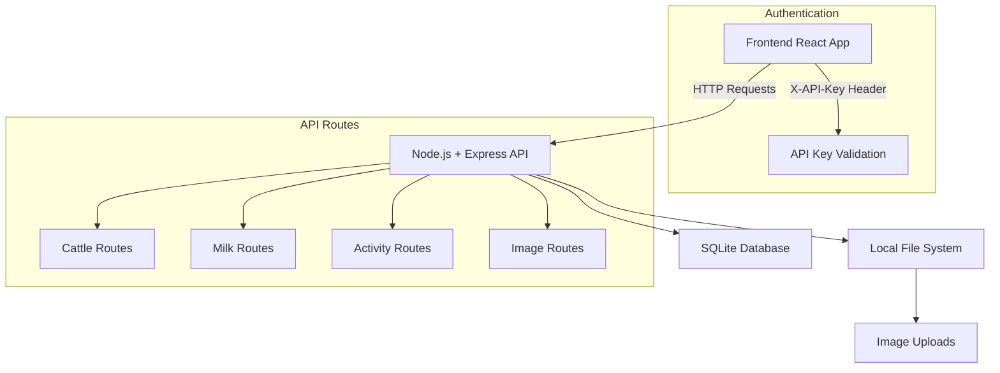
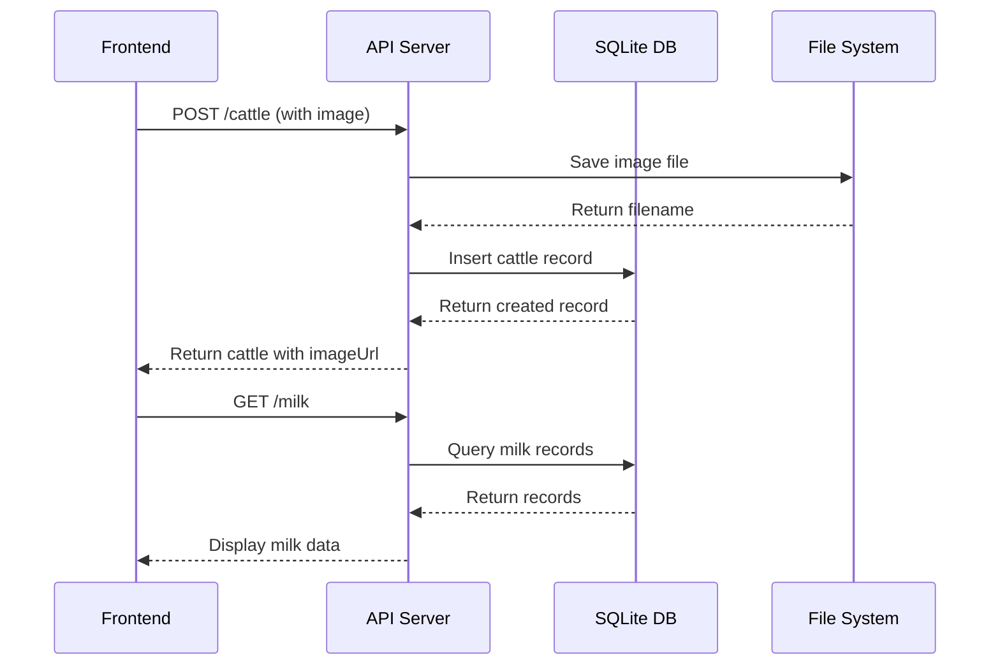

# Self-Hosted Backend Migration Plan

## Overview

Migrate the Cattle Information Keeper app from Supabase (Edge Functions + KV Store + Storage) to a self-hosted Node.js + Express + SQLite backend with local file storage for images.

## Current Architecture

```
Frontend (React/Vite)
    ↓
Supabase Edge Functions (Deno/Hono)
    ↓
Supabase KV Store (Data)
Supabase Storage (Images)
```

## New Architecture

```
Frontend (React/Vite)
    ↓
Node.js + Express API
    ↓
SQLite Database (Data)
Local File System (Images)
```

## Project Structure

```
/home/scholes/Cattle Information Keeper/
├── server/                          # New backend directory
│   ├── src/
│   │   ├── index.ts                 # Main Express app entry point
│   │   ├── config.ts                # Configuration (env vars, constants)
│   │   ├── database.ts              # SQLite database connection & schema
│   │   ├── middleware/
│   │   │   ├── auth.ts              # Simple API key authentication
│   │   │   ├── errorHandler.ts      # Global error handling
│   │   │   └── upload.ts            # Multer configuration for file uploads
│   │   ├── routes/
│   │   │   ├── cattle.ts            # Cattle CRUD endpoints
│   │   │   ├── milk.ts              # Milk records CRUD endpoints
│   │   │   ├── activities.ts        # Activity log endpoints
│   │   │   ├── images.ts            # Image upload/delete endpoints
│   │   │   └── health.ts            # Health check endpoint
│   │   └── types/
│   │       └── index.ts             # TypeScript type definitions
│   ├── uploads/                     # Local image storage directory
│   ├── migrations/                  # Database migrations
│   │   └── 001_initial.sql         # Initial schema
│   ├── package.json
│   ├── tsconfig.json
│   └── .env.example                 # Environment template
├── src/
│   └── (existing frontend code - to be updated)
├── plans/
│   └── this file
└── DEPLOYMENT.md                    # Deployment instructions
```

## Database Schema

### Tables

#### 1. `cattle` table
```sql
CREATE TABLE cattle (
  id TEXT PRIMARY KEY,
  name TEXT NOT NULL,
  breed TEXT NOT NULL,
  dateOfBirth TEXT NOT NULL,
  sex TEXT NOT NULL CHECK (sex IN ('male', 'female')),
  imageUrl TEXT,
  
  -- Breeding info (female only)
  servedDate TEXT,
  matingBreed TEXT,
  expectedCalfBirthDate TEXT,
  calfBirthDate TEXT,
  calfSex TEXT CHECK (calfSex IN ('male', 'female')),
  driedDate TEXT,
  
  -- Audit trail
  createdBy TEXT,
  createdAt TEXT NOT NULL DEFAULT (datetime('now')),
  lastEditedBy TEXT,
  lastEditedAt TEXT,
  lastEditedField TEXT
);
```

#### 2. `milk_records` table
```sql
CREATE TABLE milk_records (
  id TEXT PRIMARY KEY,
  cowName TEXT NOT NULL,
  date TEXT NOT NULL,
  morningAmount REAL NOT NULL DEFAULT 0,
  eveningAmount REAL NOT NULL DEFAULT 0,
  totalDaily REAL NOT NULL,
  addedBy TEXT,
  createdAt TEXT NOT NULL DEFAULT (datetime('now'))
);
```

#### 3. `activities` table
```sql
CREATE TABLE activities (
  id TEXT PRIMARY KEY,
  timestamp TEXT NOT NULL DEFAULT (datetime('now')),
  user TEXT NOT NULL,
  action TEXT NOT NULL CHECK (action IN ('add', 'edit', 'delete')),
  category TEXT NOT NULL CHECK (category IN ('cattle', 'milk')),
  target TEXT NOT NULL,
  details TEXT
);
```

#### 4. `users` table (optional - for future expansion)
```sql
CREATE TABLE users (
  id TEXT PRIMARY KEY,
  username TEXT UNIQUE NOT NULL,
  passwordHash TEXT NOT NULL,
  role TEXT DEFAULT 'user',
  createdAt TEXT NOT NULL DEFAULT (datetime('now'))
);
```

### Indexes for Performance
```sql
CREATE INDEX idx_cattle_name ON cattle(name);
CREATE INDEX idx_cattle_sex ON cattle(sex);
CREATE INDEX idx_milk_cowname ON milk_records(cowName);
CREATE INDEX idx_milk_date ON milk_records(date);
CREATE INDEX idx_activities_timestamp ON activities(timestamp);
CREATE INDEX idx_activities_category ON activities(category);
```

## API Endpoints

### Base URL
```
https://your-api-domain.com/api/v1
```

### Health Check
| Method | Endpoint | Description |
|--------|----------|-------------|
| GET | `/health` | API health check |

### Cattle Endpoints
| Method | Endpoint | Description |
|--------|----------|-------------|
| GET | `/cattle` | Get all cattle records |
| GET | `/cattle/:id` | Get single cattle by ID |
| POST | `/cattle` | Add new cattle record |
| PUT | `/cattle/:id` | Update cattle record |
| DELETE | `/cattle/:id` | Delete cattle record |

### Milk Records Endpoints
| Method | Endpoint | Description |
|--------|----------|-------------|
| GET | `/milk` | Get all milk records |
| POST | `/milk` | Add new milk record |
| DELETE | `/milk/:id` | Delete milk record |

### Activity Log Endpoints
| Method | Endpoint | Description |
|--------|----------|-------------|
| GET | `/activities` | Get all activity logs |
| POST | `/activities` | Add new activity log |

### Image Endpoints
| Method | Endpoint | Description |
|--------|----------|-------------|
| POST | `/images/upload` | Upload cattle image |
| DELETE | `/images/:filename` | Delete image |

## Authentication

### Simple API Key Auth
- Frontend uses `VITE_API_KEY` environment variable
- Each request includes header: `X-API-Key: your-api-key`
- Server validates against `API_KEY` environment variable

### Allowed Users (Client-side)
- Keep existing user validation in frontend
- `Lazarus` / `Lazarus2026`
- `Farmer2` / `Farmer2026`

## Frontend Changes

### Environment Variables
Add to `.env`:
```env
VITE_API_URL=http://localhost:3000
VITE_API_KEY=your-secret-api-key
```

### API Service Layer
Create `src/api/index.ts`:
```typescript
const API_URL = import.meta.env.VITE_API_URL;
const API_KEY = import.meta.env.VITE_API_KEY;

const headers = {
  'Content-Type': 'application/json',
  'X-API-Key': API_KEY,
};

export const api = {
  cattle: {
    list: () => fetch(`${API_URL}/cattle`, { headers }),
    create: (data: any) => fetch(`${API_URL}/cattle`, { method: 'POST', headers, body: JSON.stringify(data) }),
    update: (id: string, data: any) => fetch(`${API_URL}/cattle/${id}`, { method: 'PUT', headers, body: JSON.stringify(data) }),
    delete: (id: string) => fetch(`${API_URL}/cattle/${id}`, { method: 'DELETE', headers }),
  },
  milk: {
    list: () => fetch(`${API_URL}/milk`, { headers }),
    create: (data: any) => fetch(`${API_URL}/milk`, { method: 'POST', headers, body: JSON.stringify(data) }),
    delete: (id: string) => fetch(`${API_URL}/milk/${id}`, { method: 'DELETE', headers }),
  },
  activities: {
    list: () => fetch(`${API_URL}/activities`, { headers }),
    create: (data: any) => fetch(`${API_URL}/activities`, { method: 'POST', headers, body: JSON.stringify(data) }),
  },
  images: {
    upload: (file: File) => {
      const formData = new FormData();
      formData.append('file', file);
      return fetch(`${API_URL}/images/upload`, { method: 'POST', headers: { 'X-API-Key': API_KEY }, body: formData });
    },
  },
};
```

### Files to Update
1. `src/App.tsx` - Update all `fetch()` calls to use new API service
2. `src/components/ActivityLog.tsx` - Update activity fetch calls
3. Create `src/api/index.ts` - New API service layer
4. Update `.env` - Add new environment variables

## Image Upload Flow

1. Frontend selects image file
2. Frontend sends POST to `/images/upload` with FormData
3. Server:
   - Validates file type (jpg, png, gif, webp)
   - Generates unique filename (UUID + original extension)
   - Saves to `uploads/` directory
   - Returns public URL
4. Frontend uses returned URL for cattle record

### Image Serving
- Images served statically at `/uploads/*`
- Configure Express static file serving
- Consider adding simple URL signature for security

## Migration Steps

### Step 1: Create Server Project
1. Initialize Node.js project with TypeScript
2. Install dependencies (express, sqlite3, multer, cors, etc.)
3. Set up TypeScript configuration
4. Create basic Express app structure

### Step 2: Implement Database Layer
1. Create SQLite database connection
2. Write migration scripts for all tables
3. Implement CRUD helper functions
4. Add data seeding script (optional)

### Step 3: Implement API Routes
1. Create health check endpoint
2. Implement cattle routes
3. Implement milk routes
4. Implement activity routes
5. Implement image upload routes

### Step 4: Update Frontend
1. Create API service layer
2. Update environment variables
3. Modify App.tsx to use new API
4. Update ActivityLog.tsx component
5. Test all CRUD operations

### Step 5: Testing
1. Test backend API endpoints (curl or Postman)
2. Test frontend integration
3. Test image upload functionality
4. Verify data consistency

### Step 6: Deployment Prep
1. Create Dockerfile for containerized deployment
2. Create Railway/Render deployment configuration
3. Write deployment documentation
4. Set up environment variables on deployment platform

## Mermaid Architecture Diagram



## Data Flow Diagram



## Next Steps

1. **Approve this plan** - Confirm the architecture and approach
2. **Switch to Code mode** - Begin implementation
3. **Iterative development** - Build backend, then frontend, then deploy
